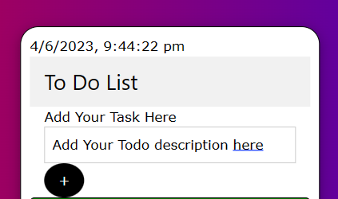
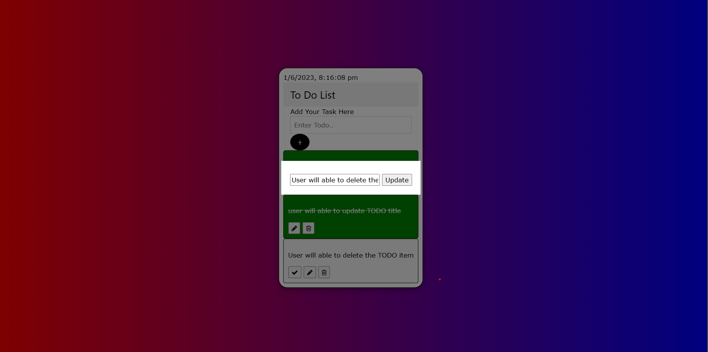

# Flask-TODO-APP

---------------------
# ** Overview **
-------------------
This is a beginner friendly Flask Todo App is a simple web application that allows users to create and manage a to-do list. It utilizes the Python Flask framework and incorporates a TinyDB database to save and retrieve the todo items. The app provides a user-friendly interface where users can add new tasks,modify the task, mark them as completed, and delete tasks they no longer need.
# Key Features:
1. Task Creation and Viewing: 
Users can create new tasks by entering a description.The app then saves the task to the database, making it accessible for future reference. Users can view their tasks in a clear and organized manner, with relevant information displayed alongside each task.

 

2. Task Updating:
Users can edit the task description and update the completion status.These updates are instantly reflected in the database, ensuring that the latest information is always available.

 

3. Database Integration:
The app integrates with TinyDB.TinyDB is a lightweight, easy-to-use, and flexible NoSQL database library for Python. It is designed to provide a simple and efficient solution for storing and querying data without the need for complex setups or heavy dependencies. With its minimalist approach, TinyDB offers a convenient way to persistently store data in a local database file, making it ideal for small to medium-sized projects or applications.

4. User-Friendly Interface: 
The app offers a clean and intuitive user interface, providing a seamless experience for users to interact with their tasks. Tasks are presented in a visually appealing manner, with options to easily update and manage them.

you can read more https://medium.com/@mohammed97ashraf/building-a-flexible-todo-app-with-flask-tinydb-and-w3css-d32509082c3d
